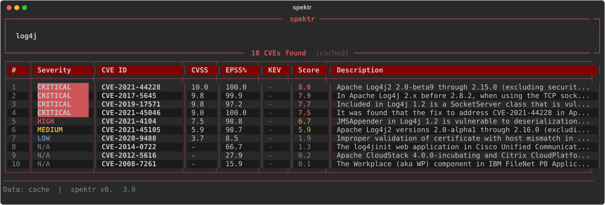

# spektr


CVE intelligence CLI with AI triage. Fetches vulnerabilities from NVD, scores them using CVSS + EPSS + KEV data, ranks results, and runs AI-powered risk analysis via Groq — all from the terminal.

No paid APIs. Cached results work offline. Built for pentesters and security folks who want fast answers.

## Tech stack

Python, Typer, Rich, httpx, SQLite. No heavy frameworks, no cloud dependencies.

## What it does

- Searches NVD for CVEs by software name/version (CPE-based version filtering)
- Pulls EPSS exploit probability scores (batched in chunks of 100)
- Checks CISA KEV catalog for known-exploited vulns
- Combines everything into a single **spektr score** (0-10)
- Caches results in SQLite so repeated queries are instant
- Pretty Rich terminal output with color-coded severity
- **AI triage** via Groq (free) — auto-runs contextual risk analysis when configured
- Markdown report export (`--output report.md`)
- Persistent config at `~/.config/spektr/config.toml`

## Install

```bash
pip install pipx  # if you don't have pipx yet
pipx install git+https://github.com/tunakum/spektr.git
```

That's it. `spektr` is now available globally, no venv activation needed.

### Development setup

```bash
git clone https://github.com/tunakum/spektr.git
cd spektr
python -m venv .venv
source .venv/bin/activate  # Windows: .venv\Scripts\activate
pip install -e ".[dev]"
pytest
```

Needs Python 3.11+.

## Usage

```bash
# search for CVEs
spektr "log4j"
spektr "nginx 1.18.0" --limit 20
spektr "apache struts 2.3" --severity critical

# look up a specific CVE
spektr cve CVE-2021-44228
spektr cve CVE-2021-44228 -o report.md

# sort by different fields
spektr "openssl" --sort epss
spektr "wordpress" --sort cvss

# export results to markdown
spektr "log4j" --output report.md

# skip cache for fresh data
spektr "log4j" --no-cache

# raw table view (skip AI triage)
spektr "log4j" --raw

# pipe-friendly (auto-strips colors)
spektr "nginx" | grep CVE
spektr "nginx" > results.txt

# configure defaults
spektr --config                        # show all settings
spektr --config limit 50               # set default limit
spektr --config nvd_api_key YOUR_KEY   # set NVD API key

# clear cached data
spektr clear-cache
```

## Example output



## Scoring

```
spektr_score = 0.50 × CVSS                       (severity anchor, max 5)
             + 0.30 × (EPSS_percentile² × 10)    (exploit prediction, max 3)
             + 2.0 × KEV_flag                    (confirmed exploitation, +2 if in CISA KEV)
```

**Bounded [0, 10] by construction** — no cap branch, no saturation cliff. The 5+3+2 weighting decomposes intent:

- **CVSS (50%)** anchors severity. A low-CVSS CVE cannot inflate to near-max via EPSS hype.
- **EPSS² (30%)** stays non-linear and selective — a CVE at 95th percentile contributes ~3.6× more than one at 50th. This is the spektr signature: predicted exploitation matters, but not at the expense of severity context.
- **KEV (+2.0 fixed)** is additive, not multiplicative. The KEV gap between two otherwise-identical CVEs is *always* exactly 2.0 — never collapses at the top, never explodes at the bottom.

Practical implication: **a score of 10 means confirmed-exploited + max severity + max prediction**. A score of 8 means severe + actively predicted, but no in-the-wild evidence yet. An 8 today can become a 10 tomorrow when KEV catches up — the formula is stable as data populates.

## AI Triage

spektr includes built-in AI triage powered by **Groq** (free tier, runs `llama-3.1-8b-instant`). When configured, every search automatically gets a contextual risk assessment from an LLM acting as a senior pentester — prioritized CVEs, attack path analysis, and recommended actions.

### Setup

1. Get a free API key at [console.groq.com](https://console.groq.com) (no credit card needed)
2. Configure spektr:
```bash
spektr --config ai_provider groq
spektr --config groq_api_key YOUR_KEY
```

That's it. AI triage now runs on every search automatically. Use `--raw` to skip AI and see the classic table view only.

### How it works

- Top 10 CVEs (by spektr score) are sent to the LLM with CVSS, EPSS, and KEV context
- The AI returns a 2-sentence summary, top 5 priority CVEs with short reasoning, an attack path, and 3 recommended actions
- Output order: header → AI triage panel → CVE table → footer
- API keys are stored in `~/.config/spektr/config.toml` and never appear in output (masked as `gsk_****hhmG`)

## Batch scanning (nmap)

Run nmap with version detection and feed the XML to spektr:

```bash
nmap -sV -oX scan.xml 10.0.0.0/24
spektr scan scan.xml
spektr scan scan.xml -o report.md
```

- Parses every `open` port with a detected `product` + `version`
- De-duplicates identical services across hosts (one CVE lookup, reused)
- Skips versionless services by default — pass `--include-unversioned` to scan anyway
- Per-host summary table in the terminal; combined Markdown report on `--output`

## Built with

Developed with [Claude](https://claude.ai) (Anthropic) as an AI coding assistant.

## License

[MIT](LICENSE) © 2026 Tunahan Kum

## Contact

- GitHub: [@tunakum](https://github.com/tunakum)
- LinkedIn: [tunahankum](https://linkedin.com/in/tunahankum)
